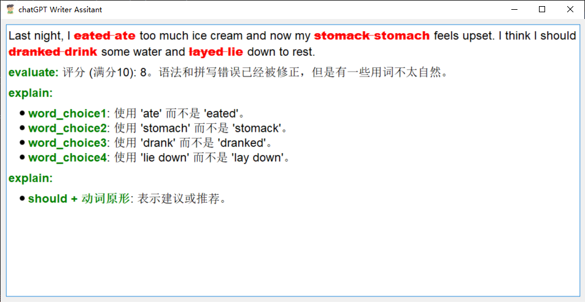

# chatGPT Writer Assitant

这个项目主要利用openai-api-key来更加方便的帮助使用者来使用openai。
其核心就是利用openai来返回结构化数据，来帮助修改使用者的所选句子，使用者直接复制所选句子后再用热键来运行程序，此时程序界面将显示出来在合适的位置
，我尝试过直接通过python第三方库来模拟ctrl+c的操作以此来省去复制句子这个环节，不过尝试了几个第三方库效果都不好，这个bug留到以后去修改吧。
用户可以把该界面拖拽到合适的位置，或者直接双击就可以再次隐藏界面。

# EWA(English Writer Assitant)
this is an app used to help English writers practice  correcting  grammar  and spell error in their sentences.
以下是一个示例图：

对于评分部分我在prompt设置时是让他倾向于更加严格的评分和评语的。然后我给的示例如下所示，当然用户可以自己修改prompt来定制适合自己的写作助手:
```json
{
"correct_sentence": "Oh Bob! Do you still remember the cricket bat you borrowed from me? Please return it to me. I will use it tomorrow.",
"evaluate":"评分 (满分10): 评语。",
"explain": {
"grammar_error1": " '板球' 应该被替换为 'cricket bat'.",
"spell_error2": " '曾经' 应该被替换为 'ever'."

},
"grammar":{
   "be used to":"一些中文解释。"
}
}
```

# CWA(Code Writer Assitant)
目前还在构思中。。。有空开发，其实主要还是在prompt的设计上以及html的表现形式上。


## 开发计划
1. 日志数据挖掘：通过日志来利用反复查询的数据进行更进一步的利用,训练使用者写作能力(EWA)。


## v0.11
1. 修复了ctrl c的问题之前的问题是因为，我在热键的on_precess的过程中模拟的，自然不行，因为此时还未释放热键，这就会导致不止ctrl+c，还有热键在同时按，
然后我开了个新的线程来做这件事，热键的线程只是用来捕捉热键，这么进行一个分离，并且ms太快了，我加了100ms的延时后才ctrl+c，最终修复了这个bug。


## v0.1 2023-06-11
1. 实现了EWA的基础功能(后台运行，双击隐藏，界面美化)。
2. 记录日志。

